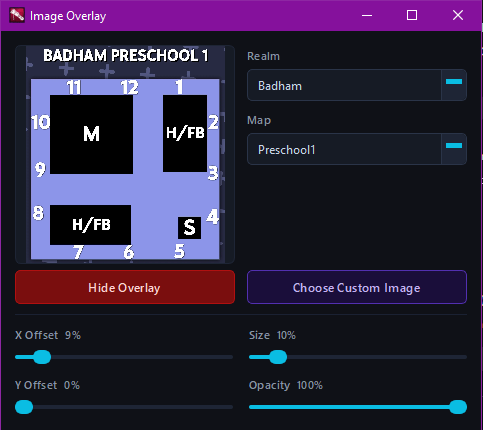

## about this program
This program allows you to easily overlay Dead by Daylight clock maps over any other desktop application including the game itself.
After choosing a map you can set its position on your screen, size and opacity.

You are also able to use any other image. PNGs with transparent parts are also supported.

Made using C++ and Qt Framework.

## credits
- emod108 for making the og
- Clockmaps by Hens333: https://hens333.com/callouts

## Known issues
- Image will not show up if you play in fullscreen mode. For this you should use windowed fullscreen or windowed modes. (this will be added in a future update)
- Sometimes the hide/show overlay button starts tweaking and spams 3 or 4 times, no clue why but until i find the fix just wait a few seconds before pressing it again

## How To Use
Download the zip in releases extract and run the exe

If you want to build yourself, you can find guides online how to build qt projects, i don't feel like writing it out here.

## Disclaimer
this code is not good, 80% of it isn't mine and seems like the previous dev made it with ai(so its not very good), it was so annoying to make build let alone add onto it. I should've just not forked it and made it myself
