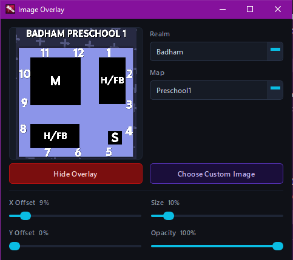

## about this program
This program allows you to easily overlay Dead by Daylight clock maps over any other desktop application including the game itself.
After choosing a map you can set its position on your screen, size and opacity.

You are also able to use any other image. PNGs with transparent parts are also supported.

Made using C++ and Qt Framework.

## disclaimer
The code in this project is not good. the project I forked it off of code was very messy and clearly made with ai. I tried cleaning the code a little but the code still isn't good.

## how to use
Download the zip on the releases tab extract it and run the exe. If you wanna build it yourself, you can find resources on how to build QMake projects online.

## credits
- emod108 for making the og
- Clockmaps by Hens333: https://hens333.com/callouts

## Known issues
- Image will not show up if you play in fullscreen mode. For this you should use windowed fullscreen or windowed modes. (this will be added in a future update)
